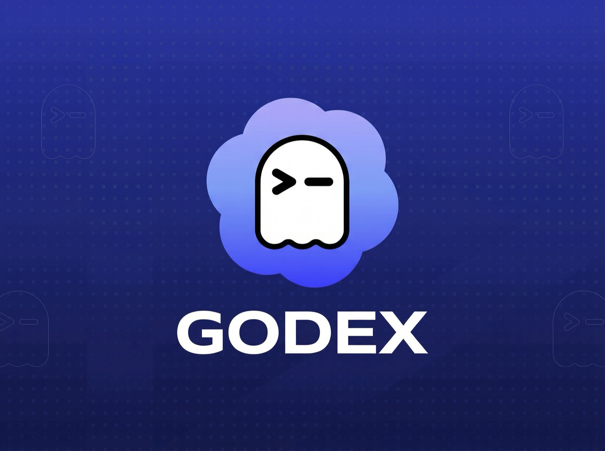

<p align="center">
  
</p>

<h1 align="center">godex</h1>

<p align="center">
  <strong>An optimized, upstream-first personal fork of OpenAI Codex.</strong>
</p>

<p align="center">
  Built to stay close to official <code>openai/codex</code> while extending it with a deliberately small fork layer:
  fork-owned release governance, dual config modes, side-by-side install support, upstream sync tooling, and a local-first release workflow.
</p>

<p align="center">
  <a href="https://github.com/LeonSGP43/godex/releases/latest"></a>
  <a href="https://github.com/LeonSGP43/godex/blob/main/LICENSE"></a>
  <a href="https://github.com/openai/codex"></a>
  
</p>

<p align="center">
  <a href="https://github.com/LeonSGP43/godex/releases/latest">Latest Release</a>
  ·
  <a href="./docs/install.md">Install</a>
  ·
  <a href="./docs/godex-memory-system.md">Memory System</a>
  ·
  <a href="./docs/godex-maintenance.md">Maintenance</a>
  ·
  <a href="./docs/godex-fork-guidelines.md">Fork Guidelines</a>
  ·
  <a href="./docs/godex-fork-manifest.md">Fork Manifest</a>
</p>

> `godex` is not a rewrite of Codex. It is an optimized personal modded edition of Codex with a deliberately small fork surface.
> Official Codex remains the product baseline. `godex` adds a thin, explicit layer for release control, install coexistence,
> fork-specific update plumbing, and long-term maintainability.
>
> `godex` is an independent personal fork and is not an official OpenAI distribution.

## Why `godex`

`godex` exists for one reason: keep the power of official Codex while making it easier to maintain as a long-lived personal distribution.

- Stay close to upstream instead of drifting into an unmergeable fork.
- Run `godex` side-by-side with official `codex` on the same machine.
- Track fork releases and official upstream changes as two separate channels.
- Use a local-first release process so the fork does not depend on GitHub Actions as its primary build machine.
- Keep every long-lived difference explicit, reviewable, and documented.

## `godex` At A Glance

| Area | `godex` extension | Why it matters |
| --- | --- | --- |
| Fork identity | Fork-owned app identity, versioning, repo links, release metadata, and startup announcement source all point to `LeonSGP43/godex`. | The fork behaves like its own distribution instead of pretending to be upstream. |
| Parallel install model | `godex` is installed and managed as `godex`, not as a replacement for `codex`. | You can keep official Codex and `godex` on the same machine without clobbering one with the other. |
| Dual config modes | Default `godex` reuses `~/.codex` and project `.codex`; `godex -g` switches to isolated `~/.godex` and project `.godex`. | You can choose compatibility mode or a clean fork-only config namespace. |
| Dual update governance | `[godex_updates]` tracks the fork's own releases, while `[upstream_updates]` tracks official `openai/codex`. | Fork release detection and upstream drift are separated instead of mixed together. |
| Upstream sync tooling | Repo-local sync helpers, constitutional docs, and `sync/<upstream-sha-or-date>` branch discipline are built into the repo. | Upstream absorption is standardized, repeatable, and safer to maintain. |
| Local-first release flow | `scripts/godex-release.sh`, `scripts/godex-release-local.sh`, and the release skill default to local build and local packaging. | The fork can be released from the maintainer machine without treating GitHub Actions as the default compiler. |
| Fork-owned maintenance layer | `scripts/godex-maintain.sh`, root constitutions, manifest rules, and acceptance gates are part of the repository. | Future updates are governed by repo law, not by memory or ad hoc shell habits. |
| QMD hybrid memory system | Two-phase memory pipeline plus local BM25+vector+RRF+rerank recall with explicit knobs in `[memories]`. | Better memory recall quality and tunability without introducing external vector services. |

The table above is the short version. The section below spells out the fork-owned additions one by one.

## Fork-Specific Additions, One By One

### 1. `godex` Has Its Own Distribution Identity

- The executable name is `godex`.
- The GitHub release repo is `LeonSGP43/godex`.
- The fork has its own version line and changelog policy.
- The startup announcement feed is fork-owned instead of upstream-owned.

Relevant files:
- `codex-rs/core/src/branding.rs`
- `codex-rs/tui/src/tooltips.rs`
- `codex-rs/tui_app_server/src/tooltips.rs`
- `announcement_tip.toml`

### 2. `godex` Can Coexist With Official Codex

- This fork is designed to live next to official `codex`, not overwrite it.
- Release-grade installs should come from the published npm package `@leonsgp43/godex`.
- Source install uses `bash scripts/install/install-godex-from-source.sh` as a development helper.
- The install flow is fork-specific and keeps `godex` isolated as its own command.

Relevant files:
- `scripts/install/install-godex-from-source.sh`
- `docs/install.md`

### 3. `godex` Supports Compatibility Mode and Isolated Mode

- Run `godex` for Codex-compatible config paths.
- Run `godex -g` for dedicated `~/.godex` / `.godex` paths.
- This makes migration and experimentation much easier than a hard break from upstream config layout.

Relevant files:
- `codex-rs/cli/src/main.rs`
- `codex-rs/core/src/config/mod.rs`
- `docs/config.md`

### 4. `godex` Separates Fork Updates From Upstream Updates

- Fork release checks point at `LeonSGP43/godex`.
- Upstream gap checks still point at `openai/codex`.
- `godex sync-upstream` stays tied to official Codex while your own release prompts stay tied to the fork.

Relevant files:
- `codex-rs/tui/src/updates.rs`
- `codex-rs/tui_app_server/src/updates.rs`
- `docs/config.md`

### 5. `godex` Has Repo-Law For Long-Term Maintenance

- Root constitutions define what is allowed in the fork.
- The fork manifest lists the long-lived differences that are permitted to survive upstream sync.
- The maintenance runbook defines acceptance gates before changes re-enter `main`.

Relevant files:
- `AGENTS.md`
- `CLAUDE.md`
- `docs/godex-fork-guidelines.md`
- `docs/godex-fork-manifest.md`
- `docs/godex-maintenance.md`

### 6. `godex` Uses a Local-First Release Workflow

- `bash scripts/godex-release.sh publish`
- `bash scripts/godex-release.sh stage`
- `bash scripts/godex-release.sh remote publish`

The default path is local build and local packaging. Remote publish remains available as a fallback, not as the primary release machine.

Relevant files:
- `scripts/godex-release.sh`
- `scripts/godex-release-local.sh`
- `scripts/godex-release-remote.sh`
- `.codex/skills/godex-release-distributor/`

### 7. `godex` Includes a QMD Hybrid Memory Mechanism

- Startup memory flow is split into Phase 1 extraction and Phase 2 consolidation.
- Memory scope can stay on shared global recall or switch to project-only recall:
  - persistent default: `[memories].scope = "global" | "project"`
  - per-launch override: `godex --memory-scope global|project`
  - project-scoped artifacts still live under the same home tree, but are
    partitioned under `~/.codex/memories/scopes/project/<project-scope-dir>`
  - project scope is resolved from the detected project root (default marker:
    `.git`), and limits extraction, consolidation, and read-path memory hints
    to that project only
- Read-path memory hints use local hybrid retrieval:
  - BM25 lexical score
  - local hash-vector semantic score
  - RRF fusion
  - lightweight rerank
- Core knobs are exposed in `[memories]`, including:
  - `qmd_hybrid_enabled`
  - `qmd_query_expansion_enabled`
  - `qmd_rerank_limit`
  - `semantic_recall_limit`
  - `semantic_index_enabled`

Typical usage:

- keep shared memory as the default, but isolate one project launch:
  - `godex --memory-scope project`
- keep project-local memory as the default in `config.toml`, but temporarily
  fall back to shared memory:
  - `godex --memory-scope global`

Storage examples:

- `godex --memory-scope global`:
  - `~/.codex/memories`
- `godex --memory-scope project`:
  - `~/.codex/memories/scopes/project/<project-scope-dir>`
- `godex -g --memory-scope project`:
  - `~/.godex/memories/scopes/project/<project-scope-dir>`

Detailed developer documentation:

- `docs/config.md`
- `docs/godex-memory-system.md`

## Current Install Status

This release line is now synced through official upstream `rust-v0.118.0`.

- Daily-use local runtime channel: the published npm package `@leonsgp43/godex`.
- Current fork release line in this repository: `0.2.18`.
- GitHub Release: used as the fork's public release signal and release history.
- Source install: keep it for maintainer validation, development, and release preparation, not as the normal daily-use distribution path.

### Recommended Install Right Now

```bash
# Use the published package when the matching release is available.
npm install -g @leonsgp43/godex@latest
```

### Development / Maintainer Source Install

```bash
git clone https://github.com/LeonSGP43/godex.git
cd godex
bash scripts/install/install-godex-from-source.sh
```

### Local Maintainer Release Commands

```bash
# Check maintenance and release status
bash scripts/godex-maintain.sh status
bash scripts/godex-maintain.sh release-preflight

# Local-first release flow
bash scripts/godex-release.sh stage
bash scripts/godex-release.sh publish

# Keep the remote path available for future use
bash scripts/godex-release.sh remote publish
```

## Positioning

Use [official Codex](https://github.com/openai/codex) if you want the upstream product defaults.

Use `godex` if you want a personal modded fork with fork-owned release governance, side-by-side install behavior, and a disciplined upstream-sync workflow.

---

## Quickstart

### Run `godex`

After installing `godex`:

```bash
godex
```

### Choose Your Config Mode

```bash
# Codex-compatible mode
godex

# Isolated godex-only mode
godex -g
```

### Sign In

Run `godex` and select **Sign in with ChatGPT** if you want to use the same authentication flow supported by upstream Codex. We recommend signing into your ChatGPT account to use Codex as part of your Plus, Pro, Business, Edu, or Enterprise plan. [Learn more about what's included in your ChatGPT plan](https://help.openai.com/en/articles/11369540-codex-in-chatgpt).

You can also use `godex` with an API key, but this requires [additional setup](https://developers.openai.com/codex/auth#sign-in-with-an-api-key).

## Docs

- [**Codex Documentation**](https://developers.openai.com/codex)
- [**Agent roles**](./docs/agent-roles.md)
- [**Contributing**](./docs/contributing.md)
- [**Installing & building**](./docs/install.md)
- [**godex memory system (QMD hybrid)**](./docs/godex-memory-system.md)
- [**godex maintenance**](./docs/godex-maintenance.md)
- [**godex fork guidelines**](./docs/godex-fork-guidelines.md)
- [**godex fork manifest**](./docs/godex-fork-manifest.md)
- [**AGENTS.md**](./AGENTS.md)
- [**CLAUDE.md**](./CLAUDE.md)
- [**Open source fund**](./docs/open-source-fund.md)

## Versioning

This fork manages its own SemVer release line for `godex`.

- The repository root `VERSION` file is the release baseline for the fork.
- `codex-rs/Cargo.toml` must match `VERSION` so `godex --version` stays accurate.
- `CHANGELOG.md` keeps both an `Unreleased` section and released version sections for future cuts.
- Never push `main` with the same `VERSION` already published on `origin/main`; bump the version, create the matching changelog release section, and empty `Unreleased` first.
- Official Codex upstream release tracking is separate from `godex`'s own fork versioning.
- Source installs should use `bash scripts/install/install-godex-from-source.sh` so `godex` and official `codex` can coexist on the same machine.

Version policy for this fork:

- Keep active work in `CHANGELOG.md -> Unreleased` until the branch is actually ready for a cut. Internal patch-layer refactors, sync preparation, and verification-only work do not require a `VERSION` bump on their own.
- Bump the patch version (`0.2.x -> 0.2.x+1`) when shipping a release that mainly contains fork maintenance, docs/runbook updates, upstream-sync integration, patch-layer cleanup, or small bug fixes.
- Bump the minor version (`0.x -> 0.(x+1).0`) when shipping a new fork-visible capability, a new operator-facing backend/config/memory surface, or a meaningful default-behavior change.
- Reserve a major version (`1.0.0+`) for an intentional compatibility reset or a stable long-term distribution contract.

## Thanks

`godex` is built on top of the official [`openai/codex`](https://github.com/openai/codex) project.

Thanks to the Codex team and upstream maintainers for building the base system that makes this fork possible.
This repository exists to personalize, optimize, and maintain a forked distribution for a specific workflow, not to erase the value of official Codex.

This repository is licensed under the [Apache-2.0 License](LICENSE).
